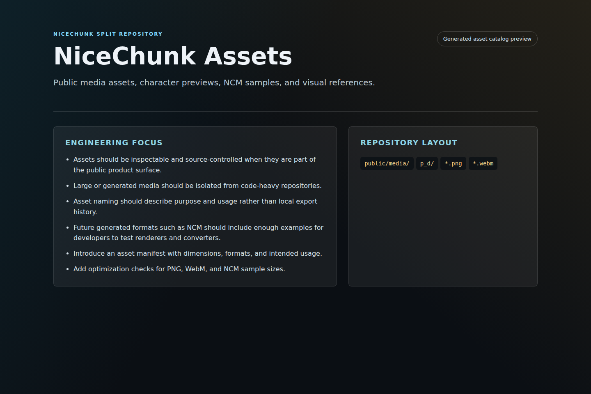
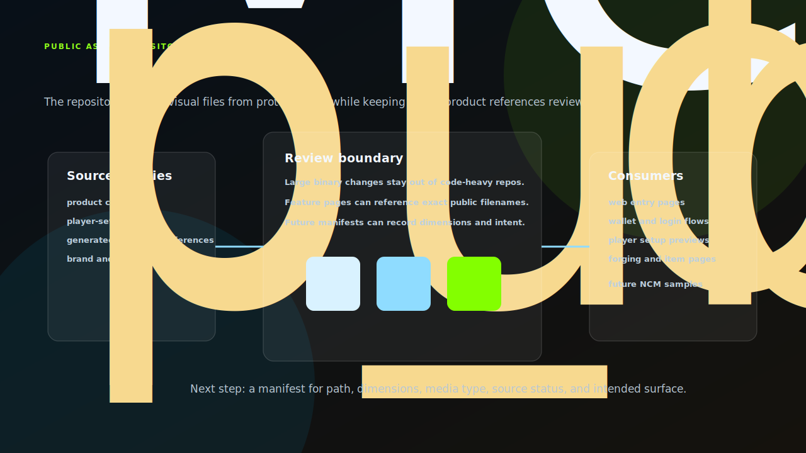
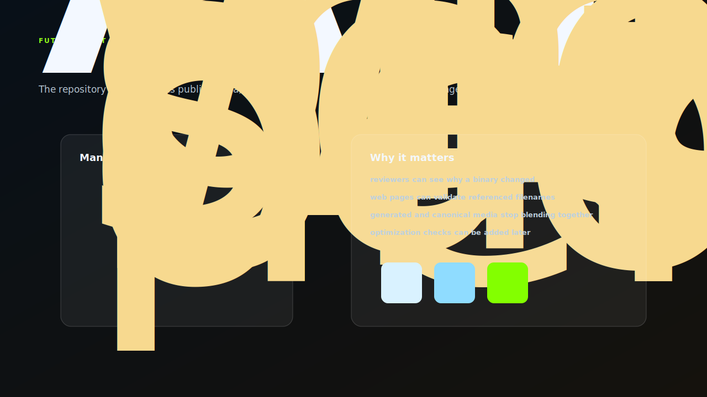

# NiceChunk Assets

Public media assets, character previews, NCM samples, and visual references.

## Project Overview

This repository contains visual and media assets used by NiceChunk. It includes product imagery, player-set references, generated character art, media files, wallet icons, and NCM sample assets.

Assets are separated from the main client so visual work can be reviewed and versioned without mixing large binary changes into gameplay or protocol repositories.

The repository is also a staging area for future asset pipeline work, including NCM samples and optimized media variants.

## Asset Supply Chain

The asset repository is not just a bucket of images. It is the review boundary for public media that product pages, login flows, player setup, forging, and future asset tooling depend on. Keeping those files here makes large binary changes visible without mixing them into program or SDK reviews.

The current structure already separates generated character references, product captures, and public media used by the site. The next professional step is a manifest that records path, dimensions, format, intended surface, source status, and whether the file is canonical or derived.

## Manifest Direction

The repository would benefit from an explicit asset manifest. A reviewer should not need to infer whether a PNG is canonical, generated, derived, obsolete, or tied to a specific page. The manifest should record path, dimensions, media type, source status, canonical status, product surface, and derivation source.

That does not need to block current asset work. It is a direction for making media review more technical and less dependent on filename memory.

## System Principles

- Assets should be inspectable and source-controlled when they are part of the public product surface.
- Large or generated media should be isolated from code-heavy repositories.
- Asset naming should describe purpose and usage rather than local export history.
- Future generated formats such as NCM should include enough examples for developers to test renderers and converters.

## How It Works

- Use the repository as the source for public media referenced by web pages.
- Keep derived formats and samples organized by feature area.
- Avoid committing private drafts, secrets, or deployment-only files.
- Coordinate asset changes with web pages that reference exact filenames.

## Why This Project Matters

Visual identity and sample assets are part of the developer experience. A clean asset repository makes it easier to fork UI projects, test renderers, and reason about media dependencies.

The split also keeps repository clones practical for developers who only need programs, SDKs, or services.

## Repository Layout

- `public/media/`
- `p_d/`
- `*.png`
- `*.webm`

## Development Workflow

1. Clone the repository and inspect the focused source tree before changing shared contracts or generated artifacts.
2. Keep changes scoped to the domain of this repository. Cross-domain changes should be coordinated through the matching split repositories.
3. Run the smallest meaningful validation for the touched surface: build checks for programs, browser checks for pages, or fixture checks for deterministic libraries.
4. Update screenshots and documentation when behavior, visible UI, public constants, or developer-facing workflows change.

## Future Development Direction

- Introduce an asset manifest with dimensions, formats, and intended usage.
- Add optimization checks for PNG, WebM, and NCM sample sizes.
- Move large production assets to a dedicated storage strategy if the repository grows too large.
- Add generated preview sheets for character and NCM assets.

## Maintenance Notes

This repository is a focused split from the main NiceChunk working tree. Keep the public surface explicit: avoid committing private keys, wallet files, deployment-only scripts, machine-specific configuration, or generated build artifacts. Runtime user-facing copy should stay behind the i18n layer where the project has an i18n surface.
